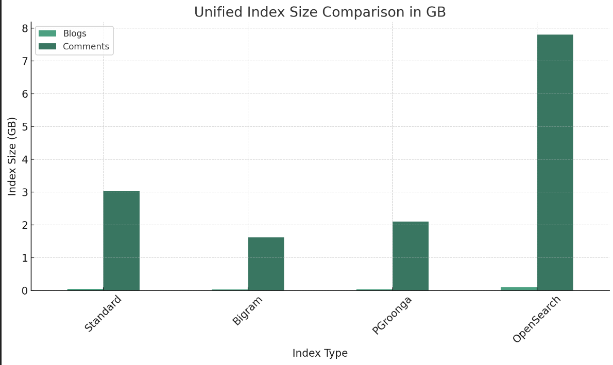
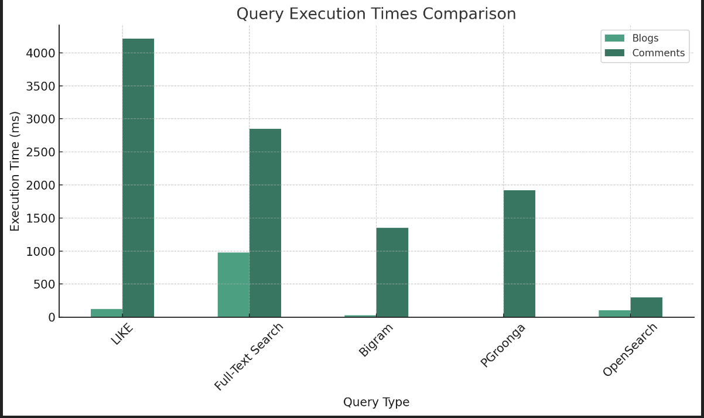

## data 準備

``` sh
# table を絞る。
pg_dump --username=ubuntu -t members -t blogs nogi-official > backup_members_blogs
# 上のやつをリストア。
## -T: tty の割り当てを無効化。
dc exec -T postgres psql -U ubuntu -d nogi-official < backup_members_blogs

dc exec -T postgres psql -U ubuntu -d nogi-official < backup_members_blogs
dc exec -T bigram psql -U ubuntu -d nogi-official < backup_members_blogs
dc exec -T pgroonga psql -U ubuntu -d nogi-official < backup_members_blogs


dc exec -T postgres psql -U ubuntu -d nogi-official < backup_comments
dc exec -T bigram psql -U ubuntu -d nogi-official < backup_comments
dc exec -T pgroonga psql -U ubuntu -d nogi-official < backup_comments
```

### データの中身について

``` sql
-- blogs
SELECT COUNT(*), AVG(LENGTH(content)), MAX(LENGTH(content)) FROM blogs;
 count |          avg          |  max  
-------+-----------------------+-------
  7191 | 1625.1348908357669309 | 13947
(1 row)

-- comments
nogi-official=# SELECT COUNT(*) FROM comments;
  count  
---------
 4338873
(1 row)
nogi-official=# SELECT AVG(LENGTH(content)), MAX(LENGTH(content)) FROM comments;
         avg          |  max  
----------------------+-------
 172.8905397784171143 | 16195
(1 row)
```

## LIKE

``` sh
EXPLAIN ANALYZE SELECT title, link FROM blogs WHERE content LIKE '%本当に%';
SELECT title, link FROM blogs WHERE content LIKE '%本当に%';
```

## [document](https://www.postgresql.jp/docs/15/textsearch.html)

- intro
  - 辞書の活用
    - インデックスしたくないストップワードの定義
    - Ispell の活用
  - tsvector というデータ型？
  - @@ 演算子

``` sql
SELECT title
FROM pgweb
WHERE to_tsvector('english', body) @@ to_tsquery('english', 'friend');
```

``` sql
SELECT title FROM blogs WHERE to_tsvector('japanese', content) @@ to_tsquery('japanese', '本当に');

-- 検索自体はできてそう
SELECT link FROM blogs WHERE to_tsvector(content) @@ to_tsquery('本当に本当に');

SELECT title, link FROM blogs WHERE to_tsvector('english', content) @@ to_tsquery('english', '本当に本当に');
```

index はる

``` sql
CREATE INDEX pgweb_idx ON blogs USING GIN (to_tsvector('english', content));
```

## pg_bigm 拡張

B-tree インデックスを適用できない問い合わせを高速化！

https://github.com/pgbigm/pg_bigm

``` diff
+ shared_preload_libraries = 'pg_bigram'  # (change requires restart)
- shared_preload_libraries = ''  # (change requires restart)
```

``` sh
apt update;
apt install -y postgresql-server-dev-15 make gcc wget libicu-dev;
wget https://ja.osdn.net/dl/pgbigm/pg_bigm-1.2-20200228.tar.gz;
tar zxf pg_bigm-1.2-20200228.tar.gz;
cd pg_bigm-1.2-20200228 && make USE_PGXS=1 && make USE_PGXS=1 install;
echo shared_preload_libraries='pg_bigm' >> /var/lib/postgresql/data/postgresql.conf;


# make psql
make bigram
CREATE EXTENSION pg_bigm;
```


docs
https://pgbigm.github.io/pg_bigm/pg_bigm_en-1-2.html

``` sql

CREATE INDEX pg_idx ON blogs USING gin (content gin_bigm_ops);

SELECT title, link FROM blogs WHERE content LIKE '%本当に本当に%';

```

```sql
SELECT * FROM blogs WHERE content LIKE '%本当に本当に%'
```

## [pgroonga](https://pgroonga.github.io/ja/tutorial/)

- [PGroonga対pg_bigm](https://pgroonga.github.io/ja/reference/pgroonga-versus-pg-bigm.html)

[install](https://pgroonga.github.io/ja/install/ubuntu.html)

``` sh
# postgresql の DockerImage では Debian の bookworm
$ lsb_release -sc
No LSB modules are available.
bookworm
```

https://pgroonga.github.io/ja/install/debian.html

``` sh
apt update;
apt install -y -V ca-certificates lsb-release wget;
wget https://apache.jfrog.io/artifactory/arrow/$(lsb_release --id --short | tr 'A-Z' 'a-z')/;apache-arrow-apt-source-latest-$(lsb_release --codename --short).deb;
apt install -y -V ./apache-arrow-apt-source-latest-$(lsb_release --codename --short).deb;
wget https://packages.groonga.org/debian/groonga-apt-source-latest-$(lsb_release --codename --short).deb;
apt install -y -V ./groonga-apt-source-latest-$(lsb_release --codename --short).deb;
apt update;


echo "deb http://apt.postgresql.org/pub/repos/apt/ $(lsb_release --codename --short)-pgdg main" | tee /etc/apt/sources.list.d/pgdg.list;
wget --quiet -O - https://www.postgresql.org/media/keys/ACCC4CF8.asc | apt-key add -;


apt update;
apt install -y -V postgresql-15-pgdg-pgroonga;
```

チュートリアル

``` sql
CREATE EXTENSION IF NOT EXISTS pgroonga;

-- 検索用の Index をはる。
CREATE INDEX pgroonga_content_index ON blogs USING pgroonga (content);

SELECT title, link FROM blogs WHERE content &@ '本当に';

SET enable_seqscan = off;
SELECT title, pgroonga_score(tableoid, ctid) AS score
  FROM blogs
 WHERE content &@ '本当に' OR content &@ '偉い';

SELECT m.name, b.link, pgroonga_score(b.tableoid, b.ctid) AS score
FROM blogs AS b
INNER JOIN members AS m ON b.member_code = m.code
WHERE content &@ '本当に' OR content &@ '偉い'
ORDER BY score DESC
;

SELECT m.name, b.link, pgroonga_score(blogs) AS score
FROM blogs AS b
INNER JOIN members AS m ON b.member_code = m.code
WHERE content &@ '本当に' OR content &@ '偉い'
ORDER BY score DESC
;
```

### スコアについて

[pgroonga_score 関数](https://pgroonga.github.io/ja/reference/functions/pgroonga-score.html)

> 現在のところ、スコアーの値は「何個キーワードが含まれていたか」（TF、Term Frequency）です。
> Groongaはどのようにスコアーを計算するかをカスタマイズすることができます。
> しかし、PGroongaはまだその機能をサポートしていません。

### ハイライト

``` sql
SELECT pgroonga_highlight_html(content,
    pgroonga_query_extract_keywords ('本当に本当に偉い')) AS highlighted_content,
    pgroonga_score(b) AS score
FROM blogs AS b
INNER JOIN members AS m ON b.member_code = m.code
WHERE
	CONTENT &@~ '本当に本当に偉い'
ORDER BY score DESC
;
```

[KWIC](https://ja.wikipedia.org/wiki/KWIC)

## 比較？

``` sql
SELECT
  nspname AS schema_name,
  relname AS table_name,
  pg_size_pretty(pg_relation_size(C.oid)) AS size
FROM pg_class C
LEFT JOIN pg_namespace N ON (N.oid = C.relnamespace)
WHERE nspname NOT IN ('pg_catalog', 'information_schema')
  AND C.relkind <> 'i'
  AND nspname !~ '^pg_toast'
ORDER BY pg_relation_size(C.oid) DESC;
 schema_name | table_name |  size   
-------------+------------+---------
 public      | comments   | 2206 MB
 public      | blogs      | 6480 kB
 public      | members    | 24 kB
(3 rows)
```

### blogs

``` sql
-- LIKE
nogi-official=# EXPLAIN ANALYZE SELECT title, link FROM blogs WHERE content LIKE '%本当に%';
----------------------------------------------------------------------------------------------------------
 Seq Scan on blogs  (cost=0.00..899.86 rows=508 width=124) (actual time=0.137..118.519 rows=3875 loops=1)
   Filter: (content ~~ '%本当に%'::text)
   Rows Removed by Filter: 3314
 Planning Time: 1.307 ms
 Execution Time: 120.614 ms
(5 rows)

-- デフォルト全文検索
nogi-official=# EXPLAIN ANALYZE SELECT link FROM blogs WHERE to_tsvector(content) @@ to_tsquery(' 本当に本当に');
---------------------------------------------------------------------------------------------------------
 Seq Scan on blogs  (cost=0.00..4494.36 rows=36 width=61) (actual time=12.773..973.990 rows=24 loops=1)
   Filter: (to_tsvector(content) @@ to_tsquery(' 本当に本当に'::text))
   Rows Removed by Filter: 7165
 Planning Time: 9.954 ms
 Execution Time: 974.110 ms

-- pg_bigram 拡張
nogi-official=# EXPLAIN ANALYZE SELECT title, link FROM blogs WHERE content LIKE '%本当に本当に%';
-------------------------------------------------------------------------------------------------------------------
 Bitmap Heap Scan on blogs  (cost=40.56..259.74 rows=73 width=124) (actual time=0.633..28.424 rows=557 loops=1)
   Recheck Cond: (content ~~ '%本当に本当に%'::text)
   Rows Removed by Index Recheck: 124
   Heap Blocks: exact=425
   ->  Bitmap Index Scan on pg_idx  (cost=0.00..40.54 rows=73 width=0) (actual time=0.502..0.502 rows=681 loops=1)
         Index Cond: (content ~~ '%本当に本当に%'::text)
 Planning Time: 0.932 ms
 Execution Time: 28.549 ms
(8 rows)

-- pgroonga 拡張
nogi-official=#  Bitmap Heap Scan on blogs  (cost=0.00..1075.39 rows=7 width=124) (actual time=1.500..2.095 rows=557 loops=1)
   Recheck Cond: (content &@ '本当に本当に'::text)
   Heap Blocks: exact=371
   ->  Bitmap Index Scan on pgroonga_score_blogs_content_index  (cost=0.00..0.00 rows=465 width=0) (actual time=1.415..1.416 rows=557 loops=1)
         Index Cond: (content &@ '本当に本当に'::text)
 Planning Time: 2.762 ms
 Execution Time: 2.259 ms
(7 rows)
```

Index 時間

``` sql
-- 標準？
nogi-official=# \timing
Timing is on.
nogi-official=# DROP INDEX pgweb_idx;
DROP INDEX
Time: 77.106 ms
nogi-official=# CREATE INDEX pgweb_idx ON blogs USING GIN (to_tsvector('english', content));
NOTICE:  word is too long to be indexed
DETAIL:  Words longer than 2047 characters are ignored.
CREATE INDEX
Time: 2995.673 ms (00:02.996)

-- bigram
nogi-official=# \timing
Timing is on.
nogi-official=# DROP INDEX pg_idx;
DROP INDEX
Time: 38.041 ms
nogi-official=# CREATE INDEX pg_idx ON blogs USING gin (content gin_bigm_ops);
CREATE INDEX
Time: 5595.814 ms (00:05.596)

-- pgroonga
nogi-official=# \timing
Timing is on.
nogi-official=# CREATE EXTENSION IF NOT EXISTS pgroonga;
CREATE EXTENSION
Time: 222.215 ms
nogi-official=# CREATE INDEX pgroonga_content_index ON blogs USING pgroonga (content);
CREATE INDEX
Time: 3614.501 ms (00:03.615)
```

Index サイズ

``` sql
-- 標準？
nogi-official=# SELECT
  i.relname as "Index",
  pg_size_pretty(pg_relation_size(i.oid)) as "Size"
FROM
  pg_class i
WHERE
  i.relkind = 'i' AND i.relname = 'pgweb_idx'
;
   Index   | Size  
-----------+-------
 pgweb_idx | 48 MB
(1 row)

-- bigram
nogi-official=# SELECT
  i.relname as "Index",
  pg_size_pretty(pg_relation_size(i.oid)) as "Size"
FROM
  pg_class i
WHERE
  i.relkind = 'i' AND i.relname = 'pg_idx'
;
 Index  | Size  
--------+-------
 pg_idx | 27 MB
(1 row)

-- pgroonga
SELECT 
  pgroonga_command('object_inspect',
                   ARRAY[
                     'name', pgroonga_index_column_name('pgroonga_content_index', 'content')
                   ])::jsonb
;
-- 35954688 bytes -> 35 MB
 [[0, 1713639820.086663, 0.002607107162475586], {"id": 270, "name": "index", "type": {"raw": {"id": 72, "name": "column:index"}, "name": "index"}, "table": {"id": 268, "key": {"type": {"id": 14, "name": "ShortText", "size": 4096, "type": {"id": 32, "name": "type"}}, "total_size": 957148, "max_total_size": 4294967294}, "name": "Lexicon20830_0", "type": {"id": 49, "name": "table:pat_key"}, "value": {"type": null}, "n_records": 160270, "disk_usage": 8437760}, "value": {"size": "normal", "type": {"id": 267, "name": "Sources20830", "size": 4, "type": {"id": 48, "name": "table:hash_key"}}, "weight": false, "section": false, "position": true, "statistics": {"max_section_id": 0, "n_array_segments": 5, "n_garbage_chunks": [0, 0, 0, 0, 0, 0, 0, 0, 0, 0, 0, 0, 0, 0, 0], "total_chunk_size": 20264232, "n_buffer_segments": 18, "n_garbage_segments": 0, "max_in_use_chunk_id": 127, "max_array_segment_id": 5, "n_unmanaged_segments": 0, "max_buffer_segment_id": 18, "max_n_physical_segments": 131072, "next_physical_segment_id": 23, "max_in_use_physical_segment_id": 22}}, "sources": [{"id": 269, "name": "content", "table": {"id": 267, "key": {"type": {"id": 11, "name": "UInt64", "size": 8, "type": {"id": 32, "name": "type"}}, "total_size": 0, "max_total_size": 4294967295}, "name": "Sources20830", "type": {"id": 48, "name": "table:hash_key"}, "value": {"type": null}, "n_records": 7189, "disk_usage": 12648448}, "full_name": "Sources20830.content"}], "full_name": "Lexicon20830_0.index", "disk_usage": 35954688}]

-- SELECT jsonb_pretty(
--   pgroonga_command('object_inspect',
--                    ARRAY[
--                      'name', pgroonga_index_column_name('pgroonga_score_blogs_content_index', 'content')
--                    ])::jsonb
-- );
```

### comments

``` sql
-- LIKE
nogi-official=# EXPLAIN (ANALYZE, BUFFERS) SELECT code, name FROM comments WHERE content LIKE '%本当に本当に%';
----------------------------------------------------------------------------------------------------------
 Gather  (cost=1000.00..310318.90 rows=43606 width=23) (actual time=30.636..4207.035 rows=14565 loops=1)
   Workers Planned: 2
   Workers Launched: 2
   ->  Parallel Seq Scan on comments  (cost=0.00..304958.30 rows=18169 width=23) (actual time=14.637..4127.135 rows=4855 loops=3)
         Filter: (content ~~ '%本当に本当に%'::text)
         Rows Removed by Filter: 1441436
 Planning Time: 3.388 ms
 JIT:
   Functions: 12
   Options: Inlining false, Optimization false, Expressions true, Deforming true
   Timing: Generation 3.678 ms, Inlining 0.000 ms, Optimization 3.030 ms, Emission 31.958 ms, Total 38.665 ms
 Execution Time: 4212.129 ms
(12 rows)

-- デフォルト全文検索
nogi-official=# EXPLAIN ANALYZE SELECT code, name FROM comments WHERE to_tsvector(content) @@ to_tsquery(' 本当に本当に');
---------------------------------------------------------------------------------------------------------
 Gather  (cost=1000.00..306001.70 rows=434 width=114) (actual time=17.565..2845.415 rows=14565 loops=1)
   Workers Planned: 2
   Workers Launched: 2
   ->  Parallel Seq Scan on comments  (cost=0.00..304958.30 rows=181 width=114) (actual time=8.124..2765.007 rows=4855 loops=3)
         Filter: (content ~~ '%本当に本当に%'::text)
         Rows Removed by Filter: 1441436
 Planning Time: 1.054 ms
 JIT:
   Functions: 12
   Options: Inlining false, Optimization false, Expressions true, Deforming true
   Timing: Generation 4.094 ms, Inlining 0.000 ms, Optimization 1.983 ms, Emission 21.428 ms, Total 27.505 ms
 Execution Time: 2850.127 ms
(12 rows)

-- pg_bigram 拡張
nogi-official=# EXPLAIN ANALYZE SELECT code, name FROM comments WHERE content LIKE '%本当に本当に%';
-------------------------------------------------------------------------------------------------------------------
 Bitmap Heap Scan on comments  (cost=67.35..1750.05 rows=432 width=23) (actual time=141.225..1348.722 rows=14565 loops=1)
   Recheck Cond: (content ~~ '%本当に本当に%'::text)
   Rows Removed by Index Recheck: 5094
   Heap Blocks: exact=18089
   ->  Bitmap Index Scan on pg_idx_c  (cost=0.00..67.24 rows=432 width=0) (actual time=138.999..138.999 rows=19659 loops=1)
         Index Cond: (content ~~ '%本当に本当に%'::text)
 Planning Time: 3.311 ms
 Execution Time: 1350.085 ms
(8 rows)

-- pgroonga 拡張
nogi-official=# EXPLAIN ANALYZE SELECT code, name FROM comments WHERE content &@ '本当に本当に';
--------------------------------------------------------------------------------------------------------------------------------------------------
 Gather  (cost=1001.09..56118.06 rows=4346 width=23) (actual time=540.655..1916.553 rows=14565 loops=1)
   Workers Planned: 2
   Workers Launched: 2
   ->  Parallel Bitmap Heap Scan on comments  (cost=1.09..54683.46 rows=1811 width=23) (actual time=265.055..1616.957 rows=4855 loops=3)
         Recheck Cond: (content &@ '本当に本当に'::text)
         Heap Blocks: exact=4428
         ->  Bitmap Index Scan on pgroonga_comment_index  (cost=0.00..0.00 rows=15465 width=0) (actual time=535.567..535.567 rows=14565 loops=1)
               Index Cond: (content &@ '本当に本当に'::text)
 Planning Time: 52.627 ms
 Execution Time: 1920.238 ms
(10 rows)
```

Index 時間

``` sql
-- 標準？
nogi-official=# CREATE INDEX pgweb_idx_c ON comments USING GIN (to_tsvector('english', content));
CREATE INDEX
Time: 492824.364 ms (08:12.824)

-- bigram
nogi-official=# \timing
Timing is on.
nogi-official=# CREATE INDEX pg_idx_c ON comments USING gin (content gin_bigm_ops);
CREATE INDEX
Time: 590411.152 ms (09:50.411)

-- pgroonga
nogi-official=# \timing
Timing is on.
nogi-official=# CREATE INDEX pgroonga_comment_index ON comments USING pgroonga (content);
CREATE INDEX
Time: 282823.189 ms (04:42.823)
```

Index サイズ

``` sql
-- 標準？
nogi-official=# SELECT
  i.relname as "Index",
  pg_size_pretty(pg_relation_size(i.oid)) as "Size"
FROM
  pg_class i
WHERE
  i.relkind = 'i' AND i.relname = 'pgweb_idx_c'
;
    Index    |  Size   
-------------+---------
 pgweb_idx_c | 3023 MB
(1 row)

-- bigram
nogi-official=# SELECT
  i.relname as "Index",
  pg_size_pretty(pg_relation_size(i.oid)) as "Size"
FROM
  pg_class i
WHERE
  i.relkind = 'i' AND i.relname = 'pg_idx_c'
;
  Index   |  Size   
----------+---------
 pg_idx_c | 1623 MB
(1 row)

-- pgroonga
SELECT 
  pgroonga_command('object_inspect',
                   ARRAY[
                     'name', pgroonga_index_column_name('pgroonga_comment_index', 'content')
                   ])::jsonb
;
-- 2253430784 bytes -> 2.1 GB
[[0, 1713642168.08903, 0.01372504234313965], {"id": 278, "name": "index", "type": {"raw": {"id": 72, "name": "column:index"}, "name": "index"}, "table": {"id": 276, "key": {"type": {"id": 14, "name": "ShortText", "size": 4096, "type": {"id": 32, "name": "type"}}, "total_size": 6717891, "max_total_size": 4294967294}, "name": "Lexicon58034_0", "type": {"id": 49, "name": "table:pat_key"}, "value": {"type": null}, "n_records": 1010780, "disk_usage": 25214976}, "value": {"size": "normal", "type": {"id": 275, "name": "Sources58034", "size": 4, "type": {"id": 48, "name": "table:hash_key"}}, "weight": false, "section": false, "position": true, "statistics": {"max_section_id": 0, "n_array_segments": 31, "n_garbage_chunks": [0, 0, 0, 0, 0, 0, 0, 0, 0, 0, 0, 0, 0, 0, 0], "total_chunk_size": 1501145599, "n_buffer_segments": 435, "n_garbage_segments": 0, "max_in_use_chunk_id": 519, "max_array_segment_id": 31, "n_unmanaged_segments": 0, "max_buffer_segment_id": 435, "max_n_physical_segments": 131072, "next_physical_segment_id": 466, "max_in_use_physical_segment_id": 465}}, "sources": [{"id": 277, "name": "content", "table": {"id": 275, "key": {"type": {"id": 11, "name": "UInt64", "size": 8, "type": {"id": 32, "name": "type"}}, "total_size": 0, "max_total_size": 4294967295}, "name": "Sources58034", "type": {"id": 48, "name": "table:hash_key"}, "value": {"type": null}, "n_records": 4338873, "disk_usage": 176226304}, "full_name": "Sources58034.content"}], "full_name": "Lexicon58034_0.index", "disk_usage": 2253430784}]

-- SELECT jsonb_pretty(
--   pgroonga_command('object_inspect',
--                    ARRAY[
--                      'name', pgroonga_index_column_name('pgroonga_score_blogs_content_index', 'content')
--                    ])::jsonb
-- );
```

## cf. opensearch

blogs 100ms, comments 300 ms とかで帰ってくる。

```
GET /blogs/_search
{
  "_source": [
    "title",
    "text"
  ],
  "query": {
    "bool": {
      "should": [
        {
          "match_phrase": {
            "text": "本当に本当に"
          }
        }
      ],
      "minimum_should_match": 1
    }
  },
  "highlight": {
    "fields": {
      "text": {}
    },
    "type": "fvh"
  }
}
```

```
GET /comments/_search
{
  "_source": [
    "name",
    "member_name",
    "blog_title"
  ],
  "query": {
    "bool": {
      "should": [
        {
          "match": {
            "text": "本当に本当に"
          }
        }
      ],
      "minimum_should_match": 1
    }
  },
  "highlight": {
    "fields": {
      "text": {}
    },
    "type": "fvh"
  }
}
```

## キャッシュを削除する

イマイチ分からなかった。。。

```
POST /_cache/clear
```

``` sql
                                                           QUERY PLAN                                                           
--------------------------------------------------------------------------------------------------------------------------------
 Gather  (cost=1000.00..306001.70 rows=434 width=114) (actual time=14.175..1706.418 rows=14565 loops=1)
   Workers Planned: 2
   Workers Launched: 2
   Buffers: shared hit=59074 read=280184 written=5
   ->  Parallel Seq Scan on comments  (cost=0.00..304958.30 rows=181 width=114) (actual time=6.572..1676.029 rows=4855 loops=3)
         Filter: (content ~~ '%本当に本当に%'::text)
         Rows Removed by Filter: 1441436
         Buffers: shared hit=59074 read=280184 written=5
 Planning:
   Buffers: shared hit=22
 Planning Time: 2.069 ms
 JIT:
   Functions: 12
   Options: Inlining false, Optimization false, Expressions true, Deforming true
   Timing: Generation 2.463 ms, Inlining 0.000 ms, Optimization 0.865 ms, Emission 17.660 ms, Total 20.988 ms
 Execution Time: 1793.335 ms
(16 rows)
```

Index Size

```
GET _cat/indices/blogs?v

health status index uuid                   pri rep docs.count docs.deleted store.size pri.store.size
yellow open   blogs bSJLiomJTaekep1xPnsP1A   1   1       7189            0     99.6mb         99.6mb
```

```
GET _cat/indices/comments?v

health status index    uuid                   pri rep docs.count docs.deleted store.size pri.store.size
yellow open   comments 1XOvEI7ZQi2OoaaYGeRN1Q   1   1    4344891            0      7.8gb          7.8gb
```





## Links

- [PostgreSQLで全文検索を実現するには](https://techblog.recochoku.jp/9920)
